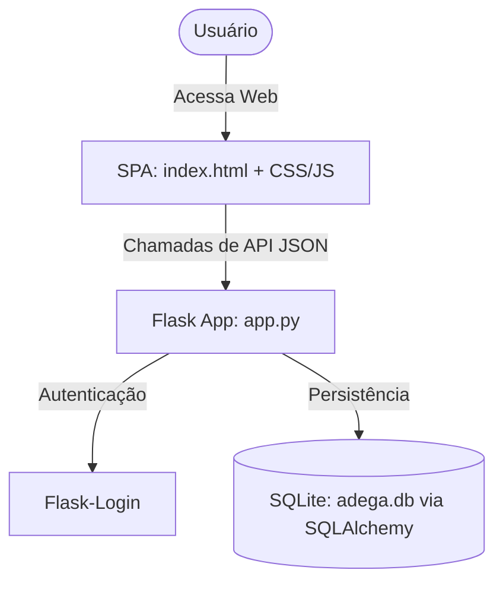

# 🍷 Relatório de Análise Técnica e Financeira: Adega Business Intelligence

Este documento apresenta uma análise detalhada da arquitetura de software, das regras de negócios financeiras implementadas e das oportunidades de otimização identificadas no projeto **Adega Business Intelligence**.

---

## 🧭 Visão Geral do Sistema

O projeto é uma ferramenta de **Engenharia Fiscal & Controle Financeiro** voltada para adegas e pequenos comércios. O objetivo principal do sistema é calcular de forma realista a viabilidade financeira e o custo operacional de pessoal frente ao faturamento do negócio. O sistema calcula a folha de pagamento real (acrescida de provisões e encargos) e sinaliza se a estrutura de custos é saudável ou se apresenta risco de liquidez.

---

## 🛠️ Arquitetura de Software e Tecnologias

O projeto adota uma arquitetura clássica baseada em **Python/Flask** para o backend e uma **Single Page Application (SPA)** baseada em HTML5, CSS3 (Glassmorphism) e Vanilla JavaScript para o frontend.

### 1. Estrutura de Arquivos
- **[app.py](file:///d:/Projetos/Engenharia-Financeira---Adega/app.py)**: Concentra toda a lógica do servidor Flask, conexão com banco de dados, login e endpoints da API REST.
- **[requirements.txt](file:///d:/Projetos/Engenharia-Financeira---Adega/requirements.txt)**: Lista de dependências (Flask, SQLAlchemy, Flask-Login, Gunicorn).
- **[templates/](file:///d:/Projetos/Engenharia-Financeira---Adega/templates)**: Contém as telas [index.html](file:///d:/Projetos/Engenharia-Financeira---Adega/templates/index.html) e [login.html](file:///d:/Projetos/Engenharia-Financeira---Adega/templates/login.html).
- **[static/](file:///d:/Projetos/Engenharia-Financeira---Adega/static)**: Armazena recursos estáticos, como a imagem de fundo `bg.png`.

### 2. Modelagem de Dados (Banco de Dados SQLite)
O sistema usa o ORM **Flask-SQLAlchemy** conectado a um banco SQLite local (`adega.db`). Há duas tabelas principais:

#### Tabela `User`
Representa as credenciais de acesso do administrador.
*   `id` (Integer, Chave Primária)
*   `username` (String, Único, Não Nulo)
*   `password` (String, Hashed, Não Nulo)

#### Tabela `DashboardState`
Armazena o estado atual do painel de controle de cada usuário.
*   `id` (Integer, Chave Primária)
*   `user_id` (Integer, Chave Estrangeira vinculada a `User.id`, Único)
*   `fat` (Float) - Faturamento Bruto Mensal
*   `socios` (Integer) - Quantidade de sócios do negócio
*   `base_esc` (Float) - Salário base para a categoria Gestão/Escritório
*   `base_cax` (Float) - Salário base para a categoria Operacional/Caixa
*   `base_rep` (Float) - Salário base para a categoria Atendente/Repositor
*   `q_esc` (Integer) - Quantidade de colaboradores na categoria Gestão/Escritório
*   `q_cax` (Integer) - Quantidade de colaboradores na categoria Operacional/Caixa
*   `q_rep` (Integer) - Quantidade de colaboradores na categoria Atendente/Repositor

---

## ⚙️ Fluxo de Trabalho e Integração da API

### 🗝️ 1. Mecanismo de Inicialização e Autenticação Dinâmica
O projeto tem um padrão de configuração inicial simplificado muito interessante no backend:
- Quando a rota `/login` recebe uma requisição (GET), ela verifica se já existe algum usuário no banco: `User.query.first() is not None`.
- Se **não existir**, a tela de login exibe uma sinalização visual de **"MODO PRIMEIRA CONFIGURAÇÃO"** no frontend.
- O primeiro formulário de login submetido com sucesso cria automaticamente esse usuário admin no banco, gera a senha encriptada com hash (`generate_password_hash`) e efetua o login.
- O login subsequente exige as credenciais válidas utilizando a verificação de hash (`check_password_hash`).

### 🔄 2. Sincronização em Tempo Real (Auto-Save com Debounce)
O frontend não exige que o usuário clique em um botão de "Salvar" após cada alteração. Toda a comunicação funciona em segundo plano:
1. Qualquer interação (digitar faturamento, alterar salários ou clicar nos botões `+`/`−` para alterar o número de colaboradores) dispara a função `run()` em JavaScript.
2. A função `run()` executa as fórmulas matemáticas localmente e atualiza a UI instantaneamente.
3. Se um cálculo for executado com alterações, um temporizador de salvamento automático (`saveTimeout`) é definido.
4. Se o usuário parar de digitar por **300ms**, o JavaScript envia um payload JSON para o endpoint `/api/save_data` via requisição POST.
5. Um indicador no canto superior direito (`#save_indicator`) mostra o status da sincronização ("Salvando..." com animação de pulsação e muda para "Sincronizado" quando concluído).

---

## 📊 Regras de Negócio e Engenharia Financeira

O cerne do sistema reside no modelo de custos de recursos humanos e na alocação de receitas. Os cálculos são definidos no script frontend em [index.html](file:///d:/Projetos/Engenharia-Financeira---Adega/templates/index.html):

### 1. O Multiplicador de Encargos Legais e Provisões
O sistema calcula o **Custo de Ocupação Real** do colaborador aplicando um fator multiplicador de **1,4x (40% de encargos adicionais)** sobre o salário base. A lógica de decomposição desses 40% é a seguinte:

| Item de Custo | Percentual Aplicado | Descrição |
| :--- | :---: | :--- |
| **Salário Base Bruto** | 100,00% | O salário contratual básico |
| **Provisão de Férias + 1/3** | 11,11% | Fração mensal do custo de férias |
| **Provisão de 13º Salário** | 8,33% | Fração correspondente a 1/12 avos |
| **FGTS e Encargos Legais** | 12,00% | Alíquotas e impostos obrigatórios |
| **Benefícios e Auxílios** | 8,56% | Vale transporte, alimentação, etc. |
| **Investimento Total Real** | **140,00%** | **Custo real por funcionário (1,4x salário)** |

### 2. A Lógica de Distribuição do Faturamento
A partir do faturamento mensal informado (`fat`), a receita é distribuída sob as seguintes premissas financeiras:

*   **Teto Operacional (65% do Faturamento)**: Valor máximo recomendado para custear a operação, incluindo Folha de Pagamento, CMV (Custo de Mercadoria Vendida - Estoque) e custos fixos (aluguel, água, energia).
*   **Fundo de Reserva & Expansão (10% do Faturamento)**: Provisão para investimentos futuros e proteção de caixa.
*   **Rendimento Proprietário / Margem Operacional Líquida (25% do Faturamento)**:
    - O lucro líquido estimado do negócio é de 25%.
    - Se houver sócios cadastrados (`socios > 0`), o valor de 25% do faturamento é dividido igualmente entre o número de sócios.
    - Se a quantidade de sócios for zero, o sistema calcula como "Rendimento Líquido Único" (25% integral).
*   **Saldo para Reposição de Estoque**: Calculado como a sobra do teto operacional subtraído do custo total real da folha de pagamento:
    $$\text{Saldo Reposição} = (\text{Faturamento} \times 0.65) - \text{Custo Real da Folha}$$
*   **Alerta de Risco de Liquidez**:
    - Se o custo total da folha comprometida ultrapassar **20%** do faturamento bruto, um alerta visual vermelho é disparado na tela informando: `ALERTA: Folha acima de 20%. Risco de liquidez.`.
    - Se estiver abaixo de 20%, a mensagem indica: `OTIMIZADO: Estrutura de pessoal saudável.`.

---

## 🔎 Análise Crítica e Oportunidades de Otimização

Embora o sistema seja funcional, fluido e tenha um design moderno utilizando Glassmorphism, foram identificadas vulnerabilidades de arquitetura e oportunidades de melhoria técnica:

### 🚨 1. Segurança e Boas Práticas (Severidade Alta)
> [!WARNING]
> A chave de segurança do Flask está fixada no código: `app.config['SECRET_KEY'] = 'adega-secret-123'` em [app.py](file:///d:/Projetos/Engenharia-Financeira---Adega/app.py#L8). 
> Para o deploy em produção, essa chave precisa ser extraída para variáveis de ambiente (usando `os.environ.get('SECRET_KEY')` ou arquivo `.env`).

### 📦 2. Modularização de Arquivos (Severidade Média)
> [!NOTE]
> O arquivo [index.html](file:///d:/Projetos/Engenharia-Financeira---Adega/templates/index.html) é extenso (mais de 1000 linhas), acumulando a estrutura DOM, os blocos de estilização CSS (`<style>`) e os scripts javascript (`<script>`).
> - **Recomendação:** Separar em arquivos separados dentro de `static/css/styles.css` e `static/js/app.js` para melhorar a legibilidade e facilitar a manutenção/testes.

### 🧮 3. Cálculo de Média Salarial Simplificado (Severidade Baixa)
> [!TIP]
> No cálculo da tabela dinâmica detalhada (linhas 870-872 do [index.html](file:///d:/Projetos/Engenharia-Financeira---Adega/templates/index.html)), o sistema calcula uma média salarial total do negócio para preencher a tabela de encargos. 
> Se houver um colaborador de Escritório que ganhe R$ 5.000 e um Caixa que ganhe R$ 1.500, a tabela de encargos individuais exibirá o cálculo sobre a média, o que mascara os encargos individuais reais.
> - **Recomendação:** Permitir que o usuário visualize a tabela de encargos detalhada por categoria ou colaborador individual, e não apenas pela média consolidada.

---

## 📋 Conclusão

O projeto **Adega Business Intelligence** é uma aplicação focada, com excelente performance visual e reatividade fluida. A combinação de cálculo em tempo real e persistência transparente via API REST torna o sistema muito intuitivo para pequenos empresários. A base lógica do modelo de 1.4x para encargos e a trava operacional de 65% refletem excelentes práticas de administração e engenharia financeira.
